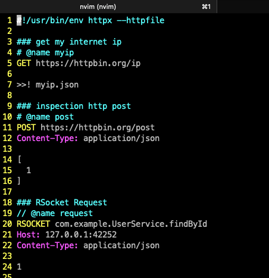

httpx.vim Neovim plugin
====================

# Getting started

* Install httpx.vim manually: 

```
git clone https://github.com/servicex-sh/httpx.vim.git \
  ~/.config/nvim/pack/github/start/httpx.vim
```

* Open index.http file and move the cursor to a request, then invoke `:Httpx` command
* You can bind keymap as following and press `ctrl-h` to make request

```
nnoremap <c-h> :Httpx<CR>
```

**Tips**: For code completion, please install [GitHub Copilot.vim](https://github.com/github/copilot.vim)

# Abbreviations

httpx vim plugin with following abbreviations by default, and you can add more customized abbreviations. 

```vim
autocmd FileType httpfile :iabbrev <buffer> hget 
\<CR>### http get
\<CR>GET http://httpbin.org/ip

autocmd FileType httpfile :iabbrev <buffer> hpost 
\<CR>### http post
\<CR>POST https://httpbin.org/post
\<CR>Content-Type: application/json
\<CR>
\<CR>
```

# ScreenShot



# References

* Nvim Documentation API: https://neovim.io/doc/user/api.html
